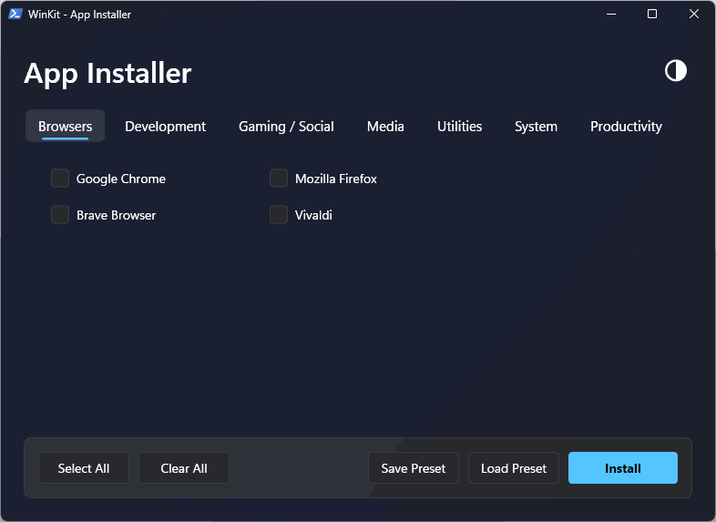

<div align="center">

# ⚡ WinKit 2.0

### Modern Windows 11 Fluent App Installer powered by WinGet

[](LICENSE)
[](https://www.microsoft.com/windows)
[](https://github.com/microsoft/winget-cli)

**🇺🇸 English** | **[🇷🇺 Русский](README.ru.md)**

<br>



<br>

**Skip the boring setup.** WinKit 2.0 is a sleek, modern Windows 11 Fluent GUI app installer. Pick all the apps you need across categories and install them in one go — no clicking through wizards, no hunting for downloads.

</div>

---

## 🚀 Quick Start

**One-liner (PowerShell):**
```powershell
irm https://raw.githubusercontent.com/Refyrd/WinKit/main/install.ps1 | iex
```

*This will download and launch the WinKit WPF GUI directly.*

### Or clone the repo

```bash
git clone https://github.com/Refyrd/WinKit.git
cd WinKit
powershell -ExecutionPolicy Bypass -File winkit.ps1
```

---

## ✨ What's New in WinKit 2.0

- 🪟 **Native Windows 11 Mica Backdrop**: Translucent glass background integrating seamlessly with Windows 11 desktop theme.
- 🌓 **Dynamic Light & Dark Themes**: Auto-detects system theme on launch and includes an instant toggle button.
- 🎨 **Modern WPF Fluent UI**: Rounded tab categories, vector checkmarks, custom buttons, and smooth hover states.
- 💾 **Preset Management**: Easily save and load your favorite app presets (`Documents\winkit-preset.txt`).
- ⚡ **One-Click Batch Install**: Select apps across multiple categories and install them all with WinGet in one click.

---

## 🎯 Features

| Feature | Description |
|---------|-------------|
| 🖥 **Modern WPF GUI** | Clean Fluent Design interface built natively with WPF |
| 🪟 **Mica Blur** | Native DWM Mica background effect for Windows 11 |
| 🌓 **Light & Dark Mode** | Automatic OS theme detection + live switch button |
| 🗂 **Categorized Tabs** | Convenient tabbed layout for Browsers, Development, Media, etc. |
| 💾 **Preset Support** | Save and load selection presets with one click |
| 📦 **Batch Controls** | Quick `Select All` and `Clear All` buttons |
| 📊 **Progress Output** | Real-time console installation tracking via WinGet |
| 🛡 **Auto-Elevate** | Requests administrator privileges automatically |

---

## 📦 Available Apps (20+)

| Category | Apps |
|----------|------|
| 🌐 **Browsers** | Google Chrome, Mozilla Firefox, Brave Browser, Vivaldi |
| 💻 **Development** | VS Code, Notepad++, Sublime Text, Git |
| 🎬 **Media** | VLC Media Player, OBS Studio, Spotify |
| 💬 **Communication** | Discord, Telegram, Skype |
| 🛠 **Utilities** | 7-Zip, WinRAR, Everything, Rufus |
| 🎮 **Games** | Steam, Epic Games |

> 💡 **Want to add your own apps?** Edit `winkit.ps1` — add `Name`, `Id`, and `Cat` into the `$apps` array.

---

## 📋 Requirements

- **Windows 10** (version 1709+) or **Windows 11**
- **WinGet** — pre-installed on Windows 11; for Windows 10, get it from the [Microsoft Store](https://aka.ms/getwinget)

---

## 🤝 Contributing

1. Fork this repo
2. Add new apps to `winkit.ps1`
3. Submit a pull request

---

## 📄 License

[MIT](LICENSE) — do whatever you want with it.

---

<div align="center">

**Made with ❤️ by [Refyrd](https://github.com/Refyrd)**

</div>
